Plotting tools
==============

The `brian2tools` package offers plotting tools for some standard plots of various `brian2` objects. It provides two
approaches to produce plots:

1. a convenience method `~brian2tools.plotting.base.brian_plot` that takes an object such as a
   `~brian2.monitors.spikemonitor.SpikeMonitor` and produces a useful plot out of it (in this case, a raster plot). This
   method is rather meant for quick investigation than for creating publication-ready plots. The details of these plots
   might change in future versions, so do not rely in this function if you expect your plots to stay the same.
2. specific methods such as `~brian2tools.plotting.data.plot_raster` or
   `~brian2tools.plotting.morphology.plot_morphology`, that allow for more detailed settings of plot parameters.

In both cases, the plotting functions will return a reference to the matplotlib `~matplotlib.axes.Axes` object, allowing
to further tweak the code (e.g. setting a title, changing the labels, etc.). The functions will automatically take care
of labelling the plot with the names of the plotted variables and their units (for this to work, the "unprocessed"
objects have to be used: e.g. plotting ``neurons.v`` can automatically state the name ``v`` and the unit of ``v``,
whereas ``neurons.v[:]`` can only state its unit and ``np.array(neurons.v)`` will state neither name nor unit).

.. contents::
    Overview
    :local:

Plotting recorded activity
--------------------------
We'll use the following example (the *CUBA example* from Brian 2) as a demonstration.

.. code:: python

    from brian2 import *

    eqs = '''dv/dt  = (ge+gi-(v + 49*mV))/(20*ms) : volt (unless refractory)
             dge/dt = -ge/(5*ms) : volt
             dgi/dt = -gi/(10*ms) : volt
          '''
    P = NeuronGroup(4000, eqs, threshold='v>-50*mV', reset='v = -60*mV', refractory=5*ms,
                    method='linear')
    P.v = 'Vr + rand() * (Vt - Vr)'
    P.ge = 0*mV
    P.gi = 0*mV

    we = (60*0.27/10)*mV # excitatory synaptic weight (voltage)
    wi = (-20*4.5/10)*mV # inhibitory synaptic weight
    Ce = Synapses(P[:3200], P, on_pre='ge += we')
    Ci = Synapses(P[3200:], P, on_pre='gi += wi')
    Ce.connect(p=0.02)
    Ci.connect(p=0.02)

    spike_mon = SpikeMonitor(P)
    rate_mon = PopulationRateMonitor(P)
    state_mon = StateMonitor(P, 'v', record=[0, 100, 1000])  # record three cells

    run(1 * second)

Spikes
~~~~~~
To plot a basic raster plot, you can call `~brian2tools.plotting.base.brian_plot` with the
`~brian2.monitors.spikemonitor.SpikeMonitor` as its argument::

    brian_plot(spike_mon)

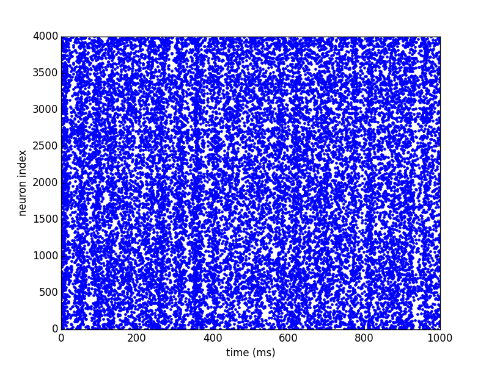

To have more control over the plot, or to plot spikes that are not stored in a
`~brian2.monitors.spikemonitor.SpikeMonitor`, use `~brian2tools.plotting.data.plot_raster`::

    plot_raster(spike_mon.i, spike_mon.t, time_unit=second, marker=',', color='k')

.. image:: ../images/plot_raster.png

Rates
~~~~~
Calling `~brian2tools.plotting.base.brian_plot` with the `~brian2.monitors.ratemonitor.PopulationRateMonitor` will plot
the rate smoothed with a Gaussian window with 1ms standard deviation.::

    brian_plot(rate_mon)

.. image:: ../images/brian_plot_rate_mon.svg

To plot the rate with a different smoothing and/or to set other details of the plot use
`~brian2tools.plotting.data.plot_raster`::

    plot_rate(rate_mon.t, rate_mon.smooth_rate(window='flat', width=10.1*ms),
              linewidth=3, color='gray')

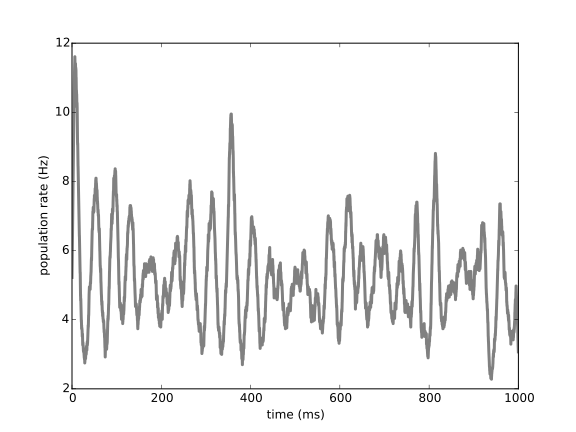

State variables
~~~~~~~~~~~~~~~
Finally, calling `~brian2tools.plotting.base.brian_plot` with the `~brian2.monitors.statemonitor.StateMonitor` will plot
the recorded voltage traces::

    brian_plot(state_mon)

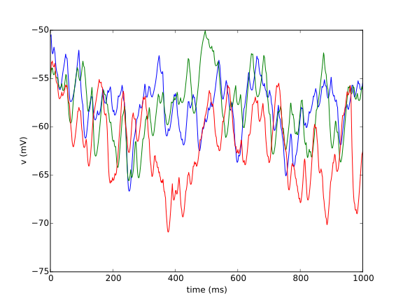

Again, for more detailed control you can directly use the `~brian2tools.plotting.data.plot_state` function. Here we also
demonstrate the use of the returned `~matplotlib.axes.Axes` object to add a legend to the plot::

    ax = plot_state(state_mon.t, state_mon.v.T, var_name='membrane potential', lw=2)
    ax.legend(['neuron 0', 'neuron 100', 'neuron 1000'], frameon=False, loc='best')

    plot_state()

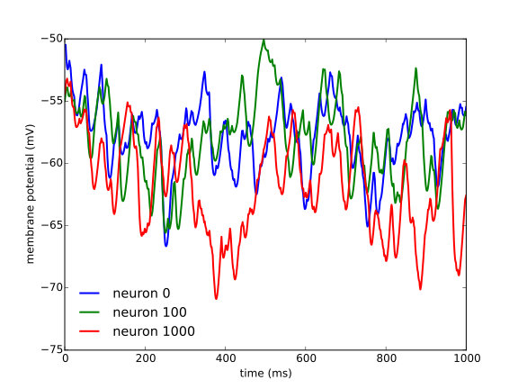

Plotting synaptic connections and variables
-------------------------------------------
For the following examples, we create synapses and synaptic weights according to "distances" (differences between the
source and target indices)::

    from brian2 import *

    group = NeuronGroup(100, 'dv/dt = -v / (10*ms) : volt',
                        threshold='v > -50*mV', reset='v = -60*mV')

    synapses = Synapses(group, group, 'w : volt', on_pre='v += w')

    # Connect to cells with indices no more than +/- 10 from the source index with
    # a probability of 50% (but do not create self-connections)
    synapses.connect(j='i+k for k in sample(-10, 10, p=0.5) if k != 0',
                     skip_if_invalid=True)  # ignore values outside of the limits
    # Set synaptic weights depending on the distance (in terms of indices) between
    # the source and target cell and add some randomness
    synapses.w = '(exp(-(i - j)**2/10.) + 0.5 * rand())*mV'
    # Set synaptic weights randomly
    synapses.delay = '1*ms + 2*ms*rand()'

Connections
~~~~~~~~~~~
A call of `~brian2tools.plotting.base.brian_plot` with a `~brian2.synapses.synapses.Synapses` object will plot all
connections, plotting either the matrix as an image, the connections as a scatter plot, or a 2-dimensional histogram
(using matplotlib's `~matplotlib.axes.Axes.hexbin` function). The decision which type of plot to use is based on some
heuristics applied to the number of synapses and might possibly change in future versions::

    brian_plot(synapses)

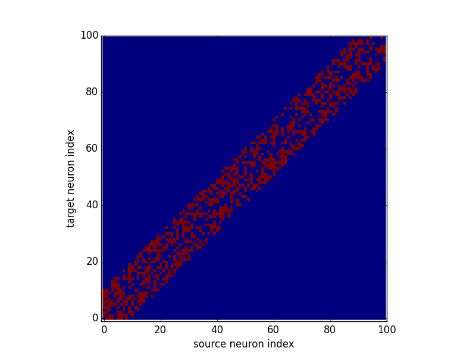

As explained above, for a large connection matrix this would instead use an approach based on a hexagonal 2D histogram::

    big_group = NeuronGroup(10000, '')
    many_synapses = Synapses(big_group, big_group)
    many_synapses.connect(j='i+k for k in range(-2000, 2000) if rand() < exp(-(k/1000.)**2)',
                          skip_if_invalid=True)
    brian_plot(many_synapses)

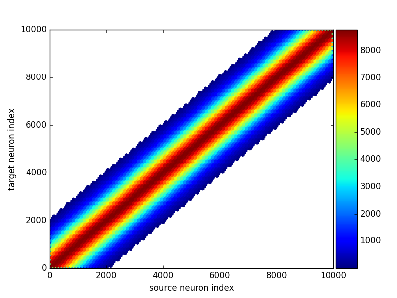

Under the hood `~brian2tools.plotting.base.brian_plot` calls `~brian2tools.plotting.synapses.plot_synapses` which can
also be used directly for more control::

    plot_synapses(synapses.i, synapses.j, plot_type='scatter', color='gray', marker='s')

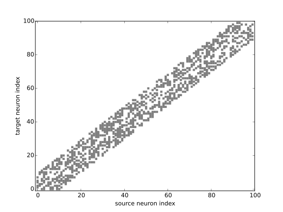

Synaptic variables (weights, delays, etc.)
~~~~~~~~~~~~~~~~~~~~~~~~~~~~~~~~~~~~~~~~~~
The `~brian2tools.plotting.synapses.plot_synapses` function can also be used to plot synaptic variables such as synaptic
weights or delays::

    subplot(1, 2, 1)
    plot_synapses(synapses.i, synapses.j, synapses.w)
    subplot(1, 2, 2)
    plot_synapses(synapses.i, synapses.j, synapses.delay)
    tight_layout()

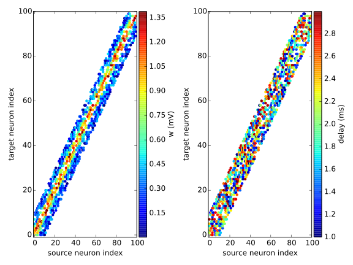

These plots can be customized using additional keyword arguments::

    ax = plot_synapses(synapses.i, synapses.j, synapses.w, var_name='synaptic weights',
                       plot_type='image', cmap='hot')
    ax.set_title('Recurrent connections')

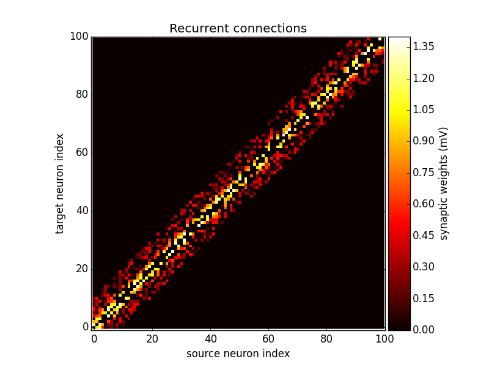

Multiple synapses per source-target pair
~~~~~~~~~~~~~~~~~~~~~~~~~~~~~~~~~~~~~~~~
In Brian, source-target pairs can be connected by more than a single synapse. In this case you cannot plot synaptic
state variables (because it is ill-defined what to plot) but you can still plot connections which will show how many
synapses exists. For example, if we make the same `~brian2.synapses.synapses.Synapses.connect` from above a second time,
the new synapses will be added to the existing ones so some source-target pairs are now connected by two synapses::

    synapses.connect(j='i+k for k in sample(-10, 10, p=0.5) if k != 0',
                     skip_if_invalid=True)

Calling `~brian2tools.plotting.base.brian_plot` or `~brian2tools.plotting.synapses.plot_synapses` will now show the
number of synapses between each pair of neurons::

    brian_plot(synapses)

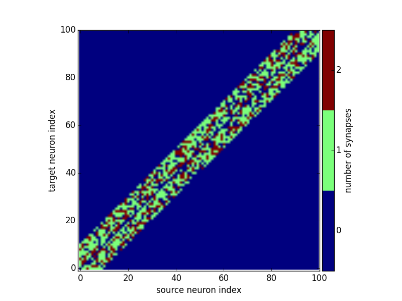

Plotting neuronal morphologies
------------------------------
In the following, we'll use a reconstruction from the Destexhe lab (a neocortical pyramidal neuron from the cat
brain [#]_) that we load into Brian::

    from brian2 import *

    morpho = Morphology.from_file('51-2a.CNG.swc')

Dendograms
~~~~~~~~~~

Calling `~brian2tools.plotting.base.brian_plot` with a `~brian2.spatialneuron.morphology.Morphology` will plot a
dendogram::

    brian_plot(morpho)

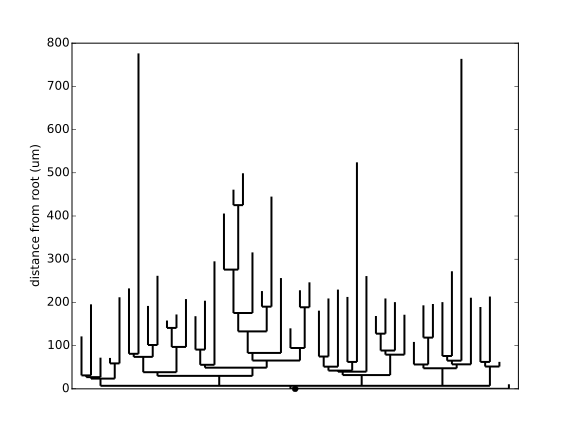

The `~brian2tools.plotting.morphology.plot_dendrogram` function does the same thing, but in contrast to the other
plot functions it does not allow any customization at the moment, so there is no benefit over using
`~brian2tools.plotting.base.brian_plot`.

.. _plotting_morphologies:

Morphologies in 2D or 3D
~~~~~~~~~~~~~~~~~~~~~~~~
In addition to the dendogram which only plots the general structure but not the actual morphology of the neuron in
space, you can plot the morphology using `~brian2tools.plotting.morphology.plot_morphology`. For a 3D morphology, this
will plot the morphology in 3D using the `Mayavi package`_ ::

    plot_morphology(morpho)

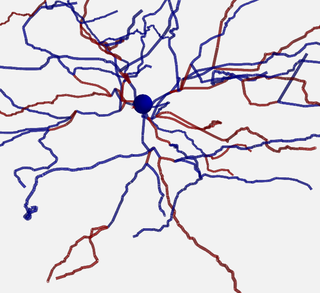

For artificially created morphologies (where one might only use coordinates in 2D) or to get a quick view of a
morphology, you can also plot it in 2D (this will be done automatically if the coordinates are 2D only)::

    plot_morphology(morpho, plot_3d=False)

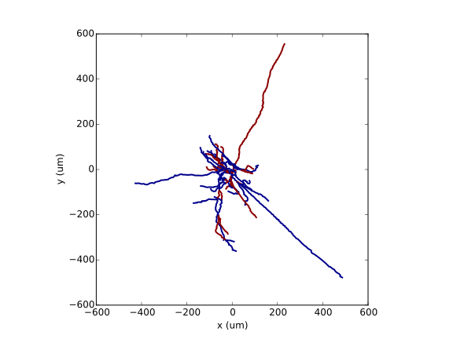

Both 2D and 3D morphology plots can be further customized, e.g. they can show the width of the compartments and do not
use the default alternation between blue and red for each section::

    plot_morphology(morpho, plot_3d=True, show_compartments=True,
                    show_diameter=True, colors=('darkblue',))

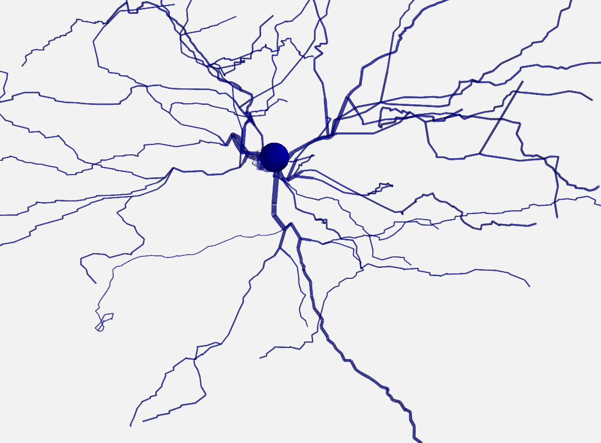

.. _`Mayavi package`: http://docs.enthought.com/mayavi/mayavi/

.. [#] Available at http://neuromorpho.org/neuron_info.jsp?neuron_name=51-2a